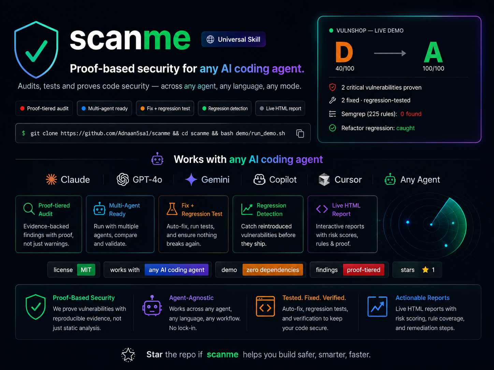

<div align="center">



<br>

[](https://github.com/Adnaan5sal/scanme/actions/workflows/demo.yml)
[](LICENSE)
[](AGENTS.md)
[](demo/README.md)
[](AGENTS.md)
[](https://github.com/Adnaan5sal/scanme/stargazers)

# Don't report vulnerabilities.<br>Prove them.

**Universal, agent-agnostic security auditing for AI-generated code.**
Reproduce vulnerabilities, fix them, and verify the fix with a regression
test that fails before the fix exists and passes after.

[See it prove a real bug in 20 seconds ↓](#the-first-15-seconds) · [Live dashboard demo](https://claude.ai/code/artifact/3f29f754-771d-444f-b756-9c60da0c921a) · [Install](#quick-start)

</div>

---

## The first 15 seconds

```
┌──────────────────────────────────────────────────┐
│                    VULNSHOP                       │
│                                                    │
│   Semgrep         225 rules  →  0 findings         │
│                                                    │
│   scanme           🔴 IDOR PROVEN                  │
│                        │                          │
│                        ▼                          │
│                    exploit                        │
│                        │                          │
│                        ▼                          │
│                       fix                         │
│                        │                          │
│                        ▼                          │
│                 regression test                   │
│                        │                          │
│                        ▼                          │
│                   ✅ VERIFIED                      │
└──────────────────────────────────────────────────┘
```

That's not illustrative copy — it's the literal output of one command,
against a real (deliberately vulnerable) API, reproduced below with every
line of terminal output included:

```bash
git clone https://github.com/Adnaan5sal/scanme
cd scanme/demo/vulnshop && bash run_demo.sh
```

Node 22.5+ and Python 3. No `npm install` — zero dependencies.

---

## What makes scanme different

Every other security tool answers "what looks wrong." scanme answers "what
did I actually demonstrate."

```
Traditional scanner                 scanme
────────────────────                ──────
       │                               │
       ▼                               ▼
  225 rules run                    candidate found
       │                               │
       ▼                               ▼
  200 findings                    reproduce / trace
       │                               │
       ▼                               ▼
  developer investigates ──┐      ✅ PROVEN  or  discarded (reason recorded)
  (4 of 5 are noise)        │           │
       │                    │           ▼
       ▼                    │        fix applied
  real bug is #47,          │           │
  buried and skimmed        │           ▼
                             │      regression test written FIRST
                             │           │
                             │           ▼
                             │      test run on unfixed code → must FAIL
                             │           │
                             │           ▼
                             │      fix applied, test run again → must PASS
                             │           │
                             └──────►  ✅ VERIFIED, not just claimed
```

False positives aren't a minor inefficiency — they're the mechanism that
gets real vulnerabilities ignored. Three noisy findings and the fourth
report stops getting read closely. scanme is built around one rule: **a
finding does not exist until it's proven**, either reproduced against a
running instance or traced completely from source to sink. Everything
unproven goes to an appendix, explicitly labeled unconfirmed — never
presented as a finding.

The reasoning behind this, and seven other judgment calls the same
discipline is built on, are written out in
[references/doctrine.md](references/doctrine.md).

---

## Supported agents

**scanme is not a Claude Code plugin that also happens to run elsewhere —
it's built agent-first.** The entire methodology lives in
[AGENTS.md](AGENTS.md), a plain-text file with no proprietary format,
paired with dependency-free Python/Bash scripts any agent can invoke
directly by running a shell command. There is no SDK, no API key, no
vendor lock-in layer between the methodology and the agent executing it.

**Verified with:**

| Agent | Status |
|---|---|
| Claude Code | ✅ Built and tested against this specifically — the demo, the finding store, the dashboard all run through it |

**Compatible in principle, not yet independently verified:**

Cursor · Gemini CLI · GitHub Copilot · Cline · OpenCode · Codex · Kiro · any
agent that can read a file and run shell commands

Why "compatible in principle" rather than a checkmark grid: AGENTS.md
requires nothing an agent-specific — no tool-calling schema, no plugin
API, just "read this file, run these commands." If your agent can do
that, the methodology works. We haven't run a live session in each of
those tools yet to confirm it end-to-end, and we're not going to claim we
did. **If you test scanme against one of these and it works (or doesn't),
[open an issue](../../issues/new/choose)** — that's the fastest way this
table gets real checkmarks instead of a compatibility argument.

The one piece that's genuinely tool-specific is
[SKILL.md](SKILL.md) — a thin wrapper that exists only because Claude Code
discovers skills by that exact filename. Everything it does is delegate
back to AGENTS.md.

---

## Quick start

**Any agent:**

```bash
git clone https://github.com/Adnaan5sal/scanme
```

Point your agent at `AGENTS.md` — paste its path into your first message,
or copy/symlink it into wherever your tool auto-reads project instructions
from (Cursor's `.cursor/rules`, Codex CLI reads `AGENTS.md` natively).

**Claude Code:**

```bash
npx skills add https://github.com/Adnaan5sal/scanme --agent claude-code -g
```

Then describe what you want — "audit this before I launch," "find security
holes in my app," "which of these scanner findings are real." No special
syntax; every mode triggers on natural language.

---

## Real demo

**Semgrep, 225 rules, finds nothing:**

```
semgrep scanned ['server.js'] with 225 rules
semgrep findings: 0
```

**scanme proves an IDOR by exploiting it** — Bob reads Alice's order:

```
Bob (user 2) requests Alice's order 4471:
{"id":4471,"user_id":1,"item":"Noise-cancelling headphones",
 "total":349.99,"card_last4":"4242"}      -> HTTP 200

unauthenticated control:
{"error":"Unauthorized"}                  -> HTTP 401
```

That 401 is the point: authentication works, **authorization was never
implemented**.

**The regression test goes red before the fix exists:**

```
AssertionError: Bob received HTTP 200 for Alice's order - expected 404
```

**Then green after it, with legitimate access intact** — `404` for Alice's
order, `200` for Bob's own. 8/8 tests pass.

**And weeks later, when a refactor silently drops the fix:**

```
REGRESSED:  1  <-- previously fixed, now back

!! idor4471  critical regressed  T1 server.js:137
 + sqli0sea  critical fixed      T1 server.js:155
```

Only the IDOR is flagged. The SQL injection stays `fixed`, because it
never came back. A security fix that silently reverts is the most
dangerous state a codebase can reach, because everyone believes it's
closed — a Markdown report can't catch that. A persistent finding ledger
can.

📄 **[Full case study, every command and output →](demo/README.md)**

---

## Proof tiers

Every candidate must reach one of these bars before it's allowed to be
called a finding:

| Tier | Standard |
|---|---|
| **1 — Reproduced** | The vulnerability is actually triggered against a local instance and observed. Request in, exploited response out. |
| **2 — Traced** | Attacker-controlled source → every hop → dangerous sink, each quoted, with no sanitizer anywhere along the path. |
| **3 — Unproven** | **Not a vulnerability.** Goes to the appendix with a note on exactly what blocked confirmation. |

And a fix isn't done until the test proves it:

```
1. Write the regression test encoding the exploit
2. Run it on the vulnerable code  →  MUST FAIL
3. Apply the fix
4. Run it again                   →  MUST PASS
5. Run the full suite             →  nothing else broke
```

Step 2 is the one everyone skips. A test that was never seen to fail
might be asserting something that was always true — you'd ship a fix
"covered" by a test that catches nothing. Watching it go red first is the
only proof the test can detect the bug at all. If any step can't
complete, the fix isn't applied — you get the patch and an honest
explanation instead.

---

## What it hunts

Ordered by how often these turn out to be real *and* serious in
AI-assisted codebases:

1. **Broken access control (IDOR)** — the #1 miss, because vulnerable code looks completely normal. Authentication answers *who are you*, not *may you touch this*.
2. **Exposed secrets** — including the vibe-coding classic: a Supabase `service_role` key on a `NEXT_PUBLIC_` prefix, shipped to every browser.
3. **Injection** — SQL, NoSQL (`{"$ne": null}` auth bypass), command, template, path traversal.
4. **XSS** — reflected, stored, DOM-based, and `javascript:` URLs that HTML-escaping doesn't stop.
5. **Auth weaknesses** — `alg: none`, unverified JWTs, `Math.random()` tokens, dev backdoors left reachable.
6. **SSRF** — especially cloud metadata endpoints.
7. **Misconfiguration** — CORS, cookie flags, leaked stack traces.
8. **Dependencies** — filtered by whether the vulnerable path is *actually reachable*, not raw `npm audit` output.

Plus seven more modes sharing the same finding store — Guard Mode
(inline while writing), Compliance Mode (35-section SOC 2/PCI DSS
readiness), AI Security Mode (prompt injection, RAG tenant isolation),
Headers Mode (CSP), Test Generation (standing authorization-matrix
suites), Readiness Mode (perf/deploy/accessibility), Swarm Mode
(multi-agent live testing, sandboxed exploit execution, auto-fix PRs).
Full detail in [AGENTS.md](AGENTS.md).

---

## Architecture

```
your agent (any)
      │
      ▼
 AGENTS.md ── the methodology: proof tiers, 8 modes, when to use each
      │
      ▼
 scripts/findings.py ── SQLite ledger: every finding's full lifecycle
      │                 (candidate → proven/discarded → fixed → regressed)
      │
      ├── scripts/sarif.py ──────── normalizes any scanner's SARIF output
      ├── scripts/run_scanners.sh ─ runs Semgrep/gitleaks/Trivy/etc if installed
      ├── scripts/guard.py ──────── inline pattern check for Guard Mode
      ├── scripts/authorize.py ──── gates live-target testing on real permission
      ├── scripts/sandbox_exec.sh ─ Docker isolation, or an honest fallback
      ├── scripts/dashboard.py ──── self-contained HTML report, no server
      └── scripts/auto_pr.sh ────── fix → PR, gated behind explicit confirmation
```

No framework, no build step, no service to run. Every script is
standalone and dependency-free — Python stdlib and Bash. The ledger is
what lets a project accumulate one audit trail across sessions and modes
instead of a pile of differently-formatted, disconnected reports.

---

## Benchmarks

The only benchmark that exists today is the one you can run yourself in
20 seconds — the vulnshop demo above. Semgrep (225 rules) finds 0. scanme
reproduces both planted vulnerabilities with a full HTTP exploit trace.

That's a fixture built specifically to demonstrate the pipeline, not a
neutral third-party comparison, and we're not going to dress it up as
one. A real benchmark — standardized vulnerable apps, published exact
vulnerabilities, raw tool output, an open scoring methodology anyone can
argue with — is on the [roadmap](#roadmap), not shipped. If you build one
before we do, we'd rather link to yours than fake ours.

---

## Roadmap

- [ ] `scanme-bench` — an open, arguable benchmark: standardized vulnerable
      apps, exact expected findings, raw output from scanme and other
      tools, published scoring methodology
- [ ] Independently verified support for at least one non-Claude agent
      (Cursor or Codex CLI first)
- [ ] A "tested against" registry — real projects scanme has been run
      against, with permission, findings verified
- [ ] CI-integrated mode: run Audit Mode on every PR, comment findings
      inline

Have an opinion on priority? [Open an issue](../../issues/new/choose).

---

## Contributing

Issues, PRs, and disagreement with the proof model are all welcome — see
[CONTRIBUTING.md](CONTRIBUTING.md). The single most useful contribution
right now: run scanme against a project you own (or have permission to
test) and report back, especially if it's in an agent other than Claude
Code, or if a proof-tier claim turns out to be wrong.

---

## What it deliberately won't do

Stated up front, because a security tool that overstates its coverage is
worse than none:

- **It's a code audit, not a penetration test.** No infrastructure, network, TLS, or cloud IAM.
- **It cannot prove absence.** "No proven findings" means exactly that — not "your app is secure."
- **It won't touch crypto, auth architecture, or business logic on its own.** Changing a hashing algorithm can lock out every user. It reports those with a recommendation and lets you decide.
- **It only audits code you control.** Point it at your repo or your local instance. It will refuse to actively probe a domain you haven't confirmed you own — unauthorized scanning is your legal problem, not a thoroughness win.

---

## Star History

<a href="https://star-history.com/#Adnaan5sal/scanme&Date">
  <picture>
    <source media="(prefers-color-scheme: dark)" srcset="https://api.star-history.com/svg?repos=Adnaan5sal/scanme&type=Date&theme=dark" />
    
  </picture>
</a>

---

<div align="center">

**If a finding you can act on immediately is worth more to you than 200 you can't, [star this repo](https://github.com/Adnaan5sal/scanme) →** ⭐

<sub>MIT License · Agent-agnostic — see <a href="https://github.com/Adnaan5sal/scanme/blob/master/AGENTS.md">AGENTS.md</a></sub>

</div>
